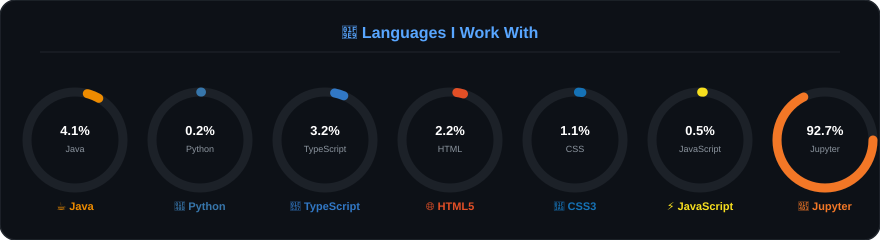

# ⚡ Sangram Adhikary
### AI/ML Engineer & Full-Stack Developer

  <a href="https://sangramadhikary.netlify.app/">🌐 Personal Portfolio</a> • 
  <a href="https://nextgenaistudio.netlify.app/">🚀 NextGen AI Studio</a>

---

## 💫 About Me

I am an AI/ML Engineer and Web Developer passionate about building intelligent, data-driven applications that deliver real-world impact. Currently pursuing a B.Tech in Computer Science (AI & ML) at Galgotias University, I specialize in machine learning, natural language processing, and interactive web technologies. My work focuses on combining technical engineering with intuitive UI/UX design to create modern, user-friendly digital solutions.

- 🔭 **Current Focus**: Building intelligent full-stack systems and automated utilities.
- 🎨 **Creative Background**: Freelance graphic designer and illustrator with 7+ years of experience. Published 3000+ digital assets on Freepik, Adobe Stock, and Shutterstock.
- 💬 **Collaborations**: Always open to collaborating on innovative AI projects, intelligent systems, and technology solutions.

---

## 🚀 Featured Live Projects

* **[NextGen AI Studio](https://nextgenaistudio.netlify.app/)** — An all-in-one AI-powered productivity tool suite featuring 30+ writing, media, detection, and developer utilities. Built with Next.js, React, and Google Gemini AI.
* **[Personal Portfolio](https://sangramadhikary.netlify.app/)** — Premium digital portfolio showcasing software engineering projects, UI/UX designs, and illustration assets.

---

## 💻 Tech Stack

### 🧠 Artificial Intelligence & Data Science

### 🌐 Frontend & Backend Web

)

### ☁️ Infrastructure & Tools

### 🎨 Creative & UI/UX Design

---

## 📊 GitHub Performance

---

## 🧩 Languages I Work With

  

---

### 🏆 Trophies

### 🔝 Top Contributions

---

  <a href="https://linkedin.com/in/sangramadhikary">💼 LinkedIn</a> •
  <a href="https://behance.net/sangramadhikary01">🎨 Behance</a> •
  <a href="mailto:sangramadhikary900@gmail.com">✉️ Email</a>

  

